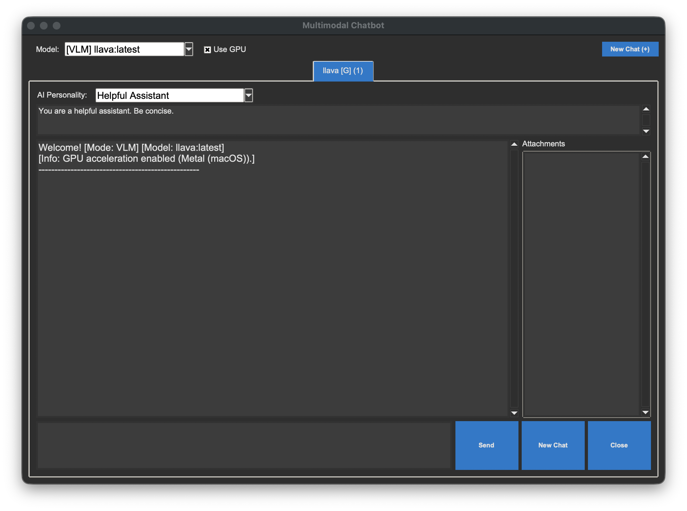

# Ollama Multimodal Chat GUI



A local, multi-tabbed, multimodal chatbot frontend for Ollama, built with Python and Tkinter.

This application provides a clean, modern desktop interface to interact with your local Ollama models. It's designed to handle multiple chat sessions at once in a tabbed interface, and it fully supports multimodal (VLM) models by allowing you to attach images, PDFs, and text files to your prompts.

## Features

* **Tabbed Interface:** Run multiple, independent chat sessions at the same time. Each tab saves its own history and personality settings.

* **Rich Text & Code Rendering:**
  * **Markdown Support:** Renders headers, bold, and italic text directly in the chat window.
  * **Syntax Highlighting:** Automatically highlights code blocks using the 'Monokai' theme via Pygments.
  * **Copy Code Button:** Each code block includes a "Copy Code" button with a visual toast notification upon success.

* **Multimodal Attachments:**
  * **Images:** Drag-and-drop or paste images directly into the chat.
  * **PDFs:** Drop a PDF file to have its text content extracted and included as context.
  * **Text/Code Files:** Drop any .txt, .py, .md, or other text-based file to use its content in your prompt.
  * **Vision Support (VLM):** Automatically detects if a selected model (like llava) is a VLM and enables image processing.

* **Model & Compute Selection:**
  * A dropdown menu dynamically populated with your LLM and VLM models.
  * A "Use GPU" toggle for each new chat tab to easily switch between CPU and GPU inference.

* **Custom AI Personality:**
  * **Preset Personas:** Choose from a dropdown of predefined personalities (e.g., Python Expert, Skeptical Scientist, Pirate).
  * **Custom Prompts:** Edit the system prompt manually to create your own custom personality.

* **Modern UI:** A custom, dark-themed Tkinter UI with robust clipboard handling (prevents freezing on paste) and helpful error messages.

## Technical Stack

* **Backend:** Ollama
* **GUI:** tkinter
* **Drag-and-Drop:** tkinterdnd2
* **Image Processing:** Pillow (PIL)
* **PDF Reading:** pypdf
* **Syntax Highlighting:** Pygments
* **Clipboard Handling:** pywin32 (Windows) / pyobjc (macOS)
* **Language:** Python 3

## Installation

Follow these steps to get the chatbot up and running.

1. Prerequisites

* Python 3.8+
* Ollama Service: You must have the Ollama desktop application installed and running on your machine.

2. Install Local Models

Before running the app, make sure you have pulled the models you want to use. Open your terminal and pull some models.

For VLMs (recommended):

```bash
ollama pull llava
````

For standard LLMs:

```bash
ollama pull gemma:latest
ollama pull mistral:7b
```

3.  Configure Your Models (Optional)

The models in the app's dropdown list are loaded from `config.py`. If you have pulled models that are not in the default lists, you must add them manually.

1.  Open the `config.py` file.
2.  Find the `VLM_MODELS` and `LLM_MODELS` lists.
3.  Add the exact name of your pulled model (e.g., `'my-custom-model:latest'`) to the correct list.

<!-- end list -->

  * `VLM_MODELS`: For models that can see images (like llava).
  * `LLM_MODELS`: For text-only models (like mistral).

<!-- end list -->

4.  Install Python Dependencies

This project's Python dependencies are listed in `requirements.txt`.

1.  Clone this repository or download the source files.
2.  Navigate to the project directory in your terminal.
3.  Install the required packages using pip:

<!-- end list -->

```bash
pip install -r requirements.txt
```

*Note: This command will automatically install platform-specific libraries (`pywin32` for Windows or `pyobjc` for macOS) required for advanced clipboard functionality.*

## How to Run

Once all prerequisites and dependencies are installed, you can start the application by running `main.py`:

```bash
python main.py
```

## How to Use

1.  **Select a Model:** Choose a model from the "Model:" dropdown at the top.
2.  **Toggle GPU:** Check or uncheck the "Use GPU" box as desired.
3.  **Start a Chat:** Click the "New Chat (+)" button. A new tab will open with your selected settings.
4.  **Set Personality (Optional):** Select a persona from the dropdown (e.g., "Python Expert") or type a custom prompt in the "AI Personality" box.
5.  **Attach Files (Optional):**
      * Drag-and-drop image, PDF, or code files onto the main chat window.
      * Copy-paste an image or file list into the text input box.
      * Attached files will appear in the "Attachments" sidebar.
6.  **Send a Message:** Type your prompt in the bottom text box and press Enter or click "Send".
7.  **Copy Code:** If the AI generates code, click the "Copy Code" button in the header of the code block. A popup will confirm the copy.
8.  **Clear Chat:** Click the "New Chat" button (inside the tab) to clear the history and attachments for the current session.
9.  **Close Tab:** Click the "Close" button to remove the current tab.

## Project Structure

The project is refactored into the following components for better readability and maintainability:

  * `main.py`: The main application entry point. Manages the root window and the tabbed notebook (`ChatbotManager`).
  * `chatbot_instance.py`: Contains the `ChatbotInstance` class. This is the "controller" for a single chat tab, handling logic, state, Ollama communication, and clipboard handling.
  * `chatbot_gui_library.py`: The "view". Contains the `ChatbotGuiLibrary` class, which handles widget construction, markdown rendering, and syntax highlighting.
  * `ollama_client.py`: Handles all communication with the Ollama API, including retry logic and GPU/CPU option building.
  * `utils.py`: Contains helper functions for file I/O (reading images, extracting PDF text, reading text files).
  * `config.py`: Stores all global constants, such as model lists, file extensions, and forbidden keywords.
  * `style.py`: Contains the `setup_styling` function to configure the application's visual theme.
  * `requirements.txt`: A list of all required Python packages.

## License

This project is unlicensed. Feel free to use, modify, and distribute it as you see fit.
